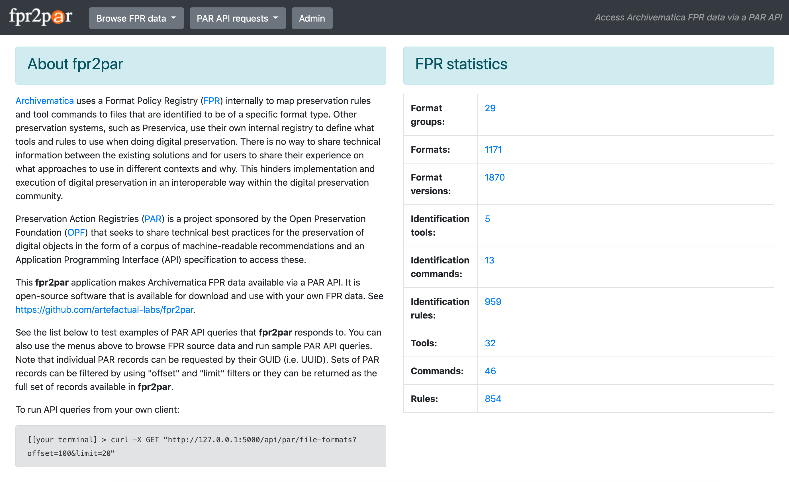

# fpr2par
Access Archivematica Format Policy Registry ([FPR](https://www.archivematica.org/en/docs/archivematica-1.11/user-manual/preservation/preservation-planning/)) data via a Preservation Actions Registry ([PAR](https://openpreservation.org/events/collaborative-preservation-with-par/)) API

* Clone files and cd to directory:  
  `git clone https://github.com/peterVG/fpr2par && cd fpr2par`  
* Set up virtualenv:  
  `virtualenv venv`  
* Activate virtualenv:  
  `source venv/bin/activate`  
* Install requirements:  
  `pip install -r requirements.txt`
* Change admin password  
  `fpr2par/__init.py__`      
* Run (on localhost, port 5000):  
  `export FLASK_APP=run.py`  
  `flask run`  
* Go to `localhost:5000` in browser to confirm that app is running
* Select "Admin" from navigation menu
* Press "Create fpr2par database" button
* Press "Load data from fixtures" button (takes approx 2 mins)
* See instructions further below if you want to load FPR data from your own instance of Archivematica instead of using the default values from the latest release
* Check CLI for import progress
* Return to UI and select "Browse FPR data" menu to view FPR contents
* Select the "PAR API requests" menu to run sample API requests
* Make PAR API requests with your own client:  
  `[your terminal]> curl -X GET "http://[your base URL]/api/par/tools`

# Load FPR data from your own instance of Archivematica
* Run the following task:  
  `docker-compose run \`  
    `--rm \`  
    `--entrypoint /src/dashboard/src/manage.py \`  
        `archivematica-dashboard \`  
            `dumpdata --output /var/archivematica/sharedDirectory/tmp/fpr2.json fpr`
* Relace the "fpr2.json" in the "fpr2par/sourceJSON/"" directory with your newly generated fpr2.json file
* From the "Admin" menu, if you've already created a FPR database, press the "Delete FPR Database" button
* Press the "Create fpr2par database" button
* Press the "Load data from fixtures" button
