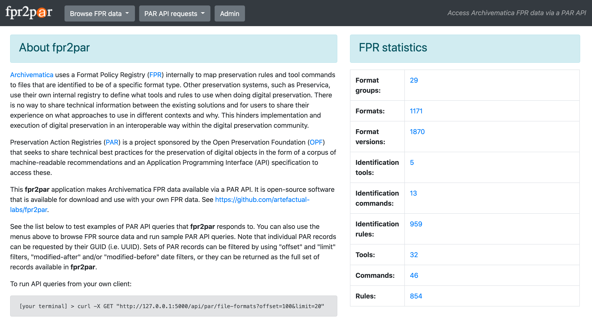

# fpr2par
Migrate Archivematica Format Policy Registry ([FPR](https://www.archivematica.org/en/docs/archivematica-1.11/user-manual/preservation/preservation-planning/)) data to a Preservation Actions Registry ([PAR](https://openpreservation.org/events/collaborative-preservation-with-par/)) API

* Clone files and cd to directory:  
  `git clone https://github.com/peterVG/fpr2par && cd fpr2par`  
* Set up virtualenv:  
  `virtualenv venv`  
* Activate virtualenv:  
  `source venv/bin/activate`  
* Install requirements:  
  `pip install -r requirements.txt`         
* Run (on localhost, port 5000):  
  `export FLASK_APP=run.py`  
  `flask run`  
* Go to `localhost:5000` in browser to confirm that app is running
* Press "Create FPR database" button
* Press "Load FPR data from fixtures" button (takes approx 2 mins)
* Check CLI for import progress
* Return to UI to browse FPR data
* See homepage for PAR API instructions

